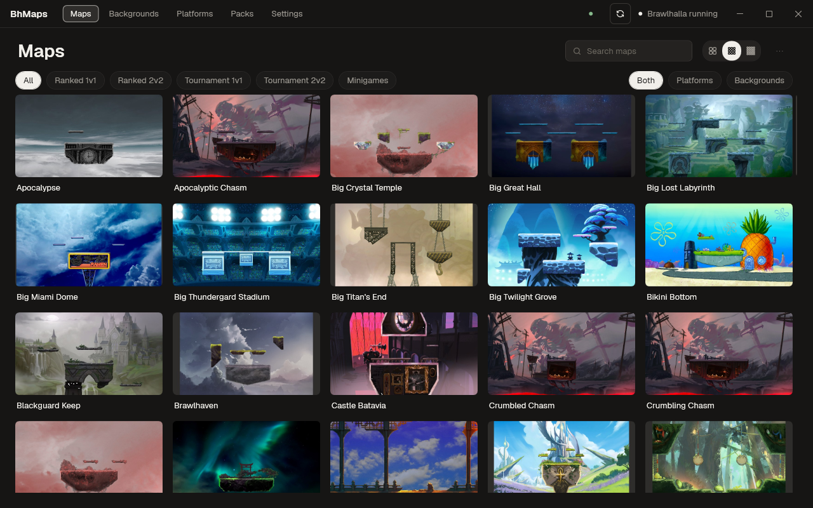
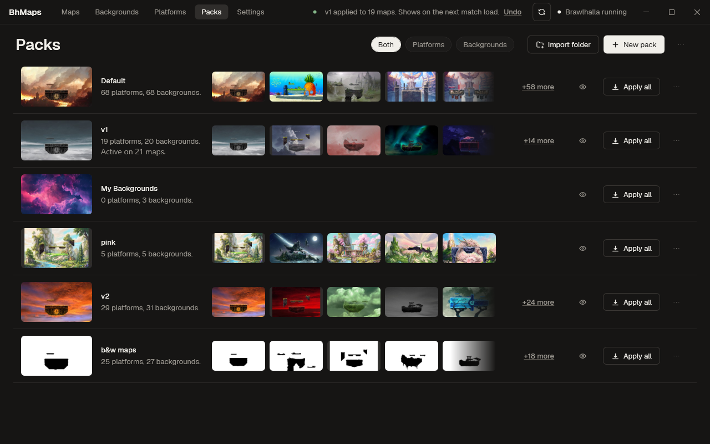
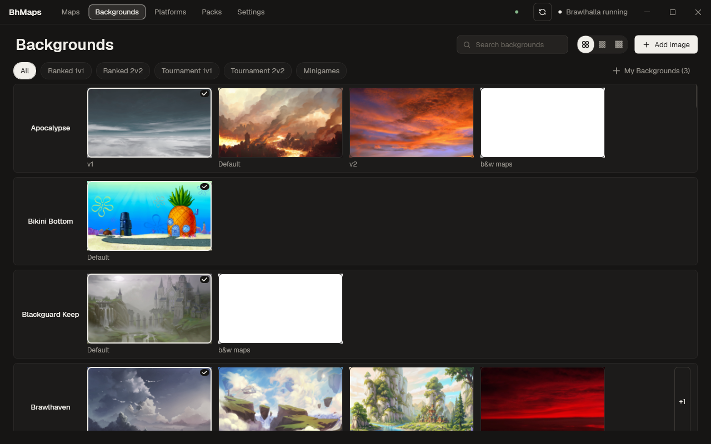
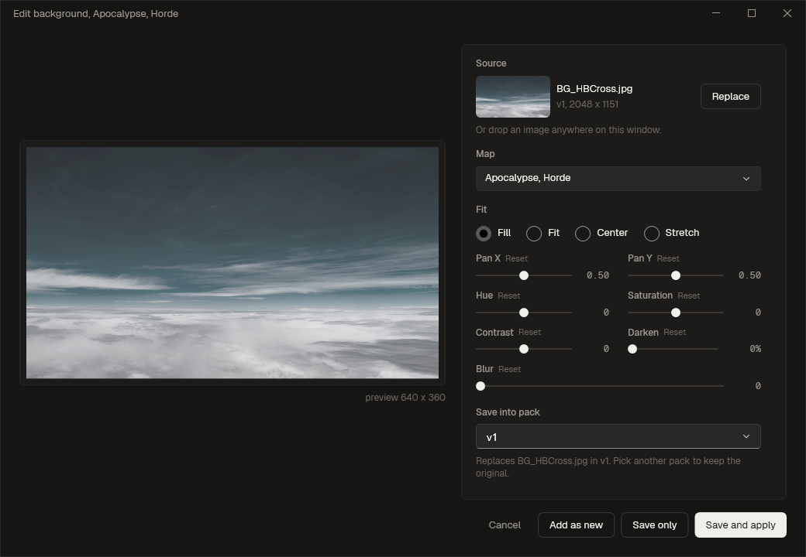
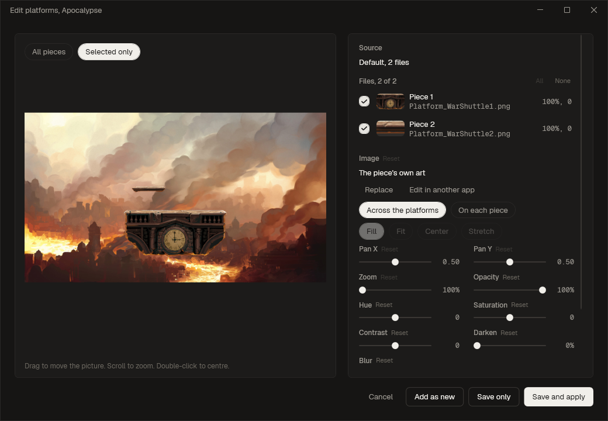

# BhMaps



Brawlhalla map art manager for Windows. It keeps packs of map art in a library, shows every map
under its in-game name with a preview composed from the game's own level data, and copies packs into
the game with one click, with an Undo for the last write.

## Download

Requires Windows 10 or 11, 64-bit, and Brawlhalla installed through Steam.

| [Releases](https://github.com/as9pa/bhmaps/releases) | Size    | Needs .NET?                                                                       |
| ---------------------------------------------------- | ------- | --------------------------------------------------------------------------------- |
| `bhmaps.exe`                                         | ~135 MB | No, the runtime is inside                                                         |
| `bhmaps-dotnet.zip`                                  | ~0.8 MB | Yes, [.NET 10 Desktop Runtime](https://dotnet.microsoft.com/download/dotnet/10.0) |

Take the `.exe` unless you already have .NET 10 installed. Windows may warn on first run because the
exe is unsigned: choose "More info", then "Run anyway".

From 2.6 the app checks this page for a newer release once a day and offers to update itself. It is
one small request to github.com, nothing about you or your library is sent, and the check can be
turned off in Settings under Updates. Both builds update in place: press **Update** in Settings and
BhMaps downloads the new version, checks it, replaces itself and restarts, with nothing to download
by hand. Keep BhMaps in a folder it can write to, such as Documents or Desktop, for that to work.

## First run

Double-click `BhMaps.exe`. The Welcome window finds the game folder through Steam, asks where to keep
the pack library (`Documents\BhMaps` by default), and offers to capture the game's current art as the
`Default` pack so any map can be reset later. Changes are written straight into the game folder, with
Brawlhalla open or closed, and show on the next match load.

## What it does

- **Map grid.** Every map under its in-game name, with a preview composed from the game's own level
  data and a tag saying what art is on it: the pack it matches, a picture's name, or Missing.
- **Packs.** Folders of map art, kept in a library. Import, export, duplicate and apply them: one
  background or platform set to a map in one click, or a whole pack to every map at once. The game's
  own art is captured as a Default pack so any map can be reset.
- **Custom images.** Add any `.png` or `.jpg` and it is fitted to the map's background size and
  written into a pack, ready to apply.
- **Platform art.** Put a custom image on platforms as well, per piece or laid across the whole set
  and dragged into place.
- **Background editor.** Pan and zoom, with Hue, Saturation, Contrast, Blur and Darken sliders over a
  live preview, for one map or for all of them. Drag the preview to move the picture and scroll to
  zoom; the sliders follow.
- **Platform editor.** A picture on the platforms gets the same Pan X, Pan Y and Zoom, dragged and
  scrolled right on the preview, plus Opacity, Hue, Saturation, Contrast, Darken and Blur per piece.
  The preview can show only the selected pieces.
- **Map-select thumbnails.** Each map's art also replaces its thumbnail on the game's map select
  screen, keeping the original for a reset.
- **Undo.** Puts back whatever the last write into the game folder overwrote or deleted.





| Background editor | Platform editor |
| --- | --- |
|  |  |

### More

- Click a map to open a panel with everything that one map can do. Right-click a map card to apply
  a pack or picture, edit it or reset it. Right-click any picture in a pack to put it on one map, a
  map picked from a list, or every map.
- Backgrounds and Platforms are one row per map with every set that map could have laid out along
  it. The My Backgrounds switch shows your own pictures on every row at once, or hides them while you
  compare packs.
- Both editors remember what was saved into a pack. Reopen one on the same map and pack and its fit,
  pan, zoom and tone sliders come back, with a Start fresh link to drop them.
- Copy to pack, Move to pack, Ctrl+C, Ctrl+X and Ctrl+V move a map or a picture between packs.
  Import from pack copies all of another pack's maps, or the ones you pick, into the one you are
  looking at. Duplicate copies a whole pack under a new name. Delete takes a picture, a platform set
  or a map out of a pack and puts the default back on any map showing it.
- Each Packs row leads with a thumbnail: the pack's first map composed with the pack's art over it,
  or its first background picture in Backgrounds mode.
- Rename a pack from its row menu or with F2. The folder on disk is renamed, and the hidden list and
  applied record follow the new name. Default cannot be renamed.
- Keyboard shortcuts: F5 rescans, Ctrl+Z undoes, Escape cancels a running write, Ctrl+1 to Ctrl+5
  switch between Maps, Backgrounds, Platforms, Packs and Settings, Ctrl+K focuses the Maps search,
  and Ctrl+plus, Ctrl+minus and Ctrl+0 change the zoom.
- Hide a pack with the eye on its Packs row. It stays in the library and keeps working, but stops
  taking up a tile on every row, except where the game is showing it.
- Refresh, next to Launch, applies again what changed at the source, restores missing files and
  rewrites the map-select thumbnails, in one write with one Undo. After a game update, a new map's
  own art goes into the Default pack by itself.
- Only `.png` and `.jpg` files inside `mapArt` are ever changed, plus the map-select thumbnails. The
  game's data files are read only. Undo puts back whatever the last write overwrote or deleted.
- Checks for a new release once a day and can update itself in place. One line in Settings turns it
  off.

## Files

Game art lives in `<Steam>\steamapps\common\Brawlhalla\mapArt`. The pack library is
`Documents\BhMaps` by default, holding packs at `packs\<name>\<GameFolder>\<file>`. A folder elsewhere
in the library with a `mapArt` folder inside it, such as `<name>\mapArt\<GameFolder>\<file>`, is found
as a pack too, as long as `mapArt` is at most three folders below the library. Those packs are read
only: they can be viewed and applied but not deleted or changed. Settings and caches are in
`%APPDATA%\BhMaps`.

## Build

```
dotnet build BhMaps.slnx
dotnet test
dotnet run --project src\BhMaps.App
pwsh -File scripts\publish.ps1
```

Needs the .NET 10 SDK. `scripts\publish.ps1` writes both release files into `dist\`.
See [docs/manual.md](docs/manual.md) for every page, how status and previews are computed,
development against a throwaway copy of the game folder, and known limitations.
